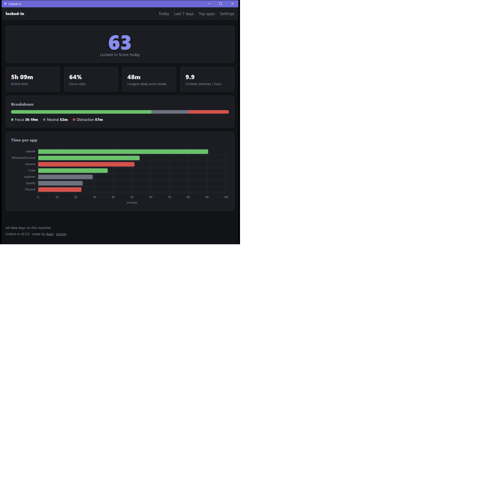

# Locked In

[](https://github.com/asanaliov/locked-in/actions/workflows/build.yml)

A small Windows app that tracks your screen time and focus. It lives in the system tray, quietly
records which app you're using, sorts each one into **Focus**, **Neutral** or **Distraction**, and
gives you a daily **Locked In Score** from 0 to 100 that says how focused you really were.



## Features

- **One small native Windows app** (`LockedIn.exe`) with a tray icon and its own window, installed with a normal setup wizard
- **Background tracking** that checks the foreground window every 3 seconds and uses almost no battery
- **Idle detection**: after 2 minutes without keyboard or mouse input it stops counting
- **Categories** from simple rules: process names, plus title keywords for browsers
  (a YouTube tab is a distraction, a GitHub tab is focus)
- **Locked In Score**, focus ratio, longest deep work streak and context switches per hour
- **Dashboard window**: today with your score and stage, screen time by hour and day, the last 7 days, top apps with their real icons, and settings
- **Stages of locked in**: Brain idle, Warming up, In the zone and, from a score of 75, Locked in
- **Settings** for light, dark or system theme, accent colour, animations, idle time, window titles and streak breaks
- **Tray icon** showing today's score and your current streak on hover, with an optional "Start with Windows"
- **Private by default**: everything stays in one local SQLite file, and window titles aren't saved

## How the Locked In Score works

Each day gets three numbers, all counted over *active* (non-idle) time:

| Metric | Meaning |
| --- | --- |
| Focus ratio | Focus time ÷ active time |
| Longest streak | Longest run of Focus time. Breaks shorter than 30 s (a quick look at chat, a short idle) don't end it |
| Context switches / hour | How often you moved from one app to another |

They're combined like this:

```
score = 100 × ( 0.6 × focus ratio
              + 0.3 × min(longest streak, 90 min) / 90 min
              + 0.1 × (1 − min(switches per hour, 60) / 60) )
```

So a day spent fully in focus apps, with one 90-minute streak and no app switching, scores 100.
All the weights live in one class, [`LockedInScoreCalculator`](src/LockedIn.Data/Metrics/LockedInScoreCalculator.cs).

## Install

1. Download `locked-in-setup-x.y.z.exe` from the [latest release](https://github.com/asanaliov/locked-in/releases/latest).
2. Run it. It installs for your user only, so no admin rights are needed, and it includes everything
   it needs (no separate .NET install).
3. Locked In opens its window and starts tracking. Closing the window keeps it running in the tray;
   right-click the tray icon to reopen it, turn **Start with Windows** on or off, or exit.

To uninstall, use **Settings → Apps**. Your tracking data in
`%LOCALAPPDATA%\LockedIn` is kept; delete that folder to remove it too.

### Updates

You only download the installer once. Locked In checks GitHub for a new release a couple of minutes
after it starts and then once a day. When one is out, the tray shows a notification and an
**Update to x.y.z** item, and Settings shows an **Update** button. One click downloads the new
installer from this repository's releases, installs it silently and restarts Locked In. Your data
and settings are kept.

The check is a single request to GitHub with nothing about you or your usage in it. You can turn it
off under **Settings → Updates** and use **Check now** whenever you like.

## Build from source

You need Windows 10 or 11 and the [.NET 10 SDK](https://dotnet.microsoft.com/download).

```bash
git clone https://github.com/asanaliov/locked-in.git
```

```bash
dotnet run --project src/LockedIn.App
```

```bash
dotnet test
```

To build the installer yourself, publish the app and compile [`installer/LockedIn.iss`](installer/LockedIn.iss)
with [Inno Setup 6](https://jrsoftware.org/isinfo.php):

```bash
dotnet publish src/LockedIn.App -c Release -r win-x64 --self-contained -o artifacts/publish
```

```bash
iscc /DAppVersion=0.3.0 installer/LockedIn.iss
```

Pushing a `v*` tag runs the [release workflow](.github/workflows/release.yml), which builds the
installer and attaches it to the GitHub release.

## Configuration

Settings live in `lockedin.json` next to `LockedIn.exe` (source: [`src/LockedIn.Data/lockedin.json`](src/LockedIn.Data/lockedin.json)).
Restart Locked In after editing it.
You can override any value with environment variables, for example `LockedIn__DatabasePath`.

| Setting | Default | |
| --- | --- | --- |
| `DatabasePath` | `%LOCALAPPDATA%\LockedIn\data.db` | SQLite file (WAL mode) |
| `Tracker:PollInterval` | `00:00:03` | How often the foreground window is checked |
| `Tracker:IdleThreshold` | `00:02:00` | No input for this long means idle |
| `Tracker:StoreWindowTitles` | `false` | Save window titles with each session |
| `Metrics:StreakInterruptionTolerance` | `00:00:30` | Breaks shorter than this don't end a streak |
| `Updates:CheckAutomatically` | `true` | Check GitHub for a new release once a day |
| `Categories:Apps` | Rider, VS Code, terminals → Focus; Explorer, Settings → Neutral; Discord, Steam → Distraction | Process name (without `.exe`) → category |
| `Categories:Browsers` | Chrome, Edge, Firefox, … | Apps whose tab title is matched against the keywords |
| `Categories:TitleKeywords` | `youtube` → Distraction, `github` / `stackoverflow` / `docs` → Focus, … | Keyword in the title → category |

Apps with no rule are **Neutral**. You can change any app's category on the dashboard's **Settings**
page. That choice is stored in the database, wins over `lockedin.json`, and also updates that app's
past sessions.

## Project structure

```
LockedIn.sln
├── src/
│   ├── LockedIn.App/        LockedIn.exe: WPF window and tray icon hosting the tracker in one process
│   │   ├── Views/           The pages: Today, Screen time, Last 7 days, Top apps, Settings
│   │   ├── Controls/        Hand-drawn score ring, bars and column chart
│   │   ├── Services/        Reads metrics and saves settings for the pages
│   │   └── Theming/         Light and dark palettes, accents and animations
│   ├── LockedIn.Data/       EF Core DbContext, entities and migrations (SQLite),
│   │                        classification rules, metrics and the score calculator
│   ├── LockedIn.Tracker/    Background tracking: polling, idle detection, session saving
│   │   ├── Native/          NativeMethods.cs, the only place with P/Invoke (user32.dll)
│   │   ├── Windows/         IActiveWindowProvider and IIdleDetector with their Win32 versions
│   │   └── Sessions/        SessionTracker (the core logic) and the SQLite session store
├── installer/               Inno Setup script
└── tests/
    └── LockedIn.Tests/      xUnit tests for session logic, classification, streaks and the score
```

The window is plain WPF, drawn by the app itself: no browser engine, no web server and no chart library.
The tracker only talks to Windows through `IActiveWindowProvider`, `IIdleDetector` and `IClock`,
so its logic is unit tested with fakes and no Windows API calls.

## Privacy

- All data stays in one SQLite file on your machine. There are no accounts, no telemetry and no
  network calls from the tracker.
- Window titles are only used to classify browser tabs and are **not saved** unless you turn on
  `StoreWindowTitles`.
- The only network request is the daily update check to GitHub (see [Updates](#updates)); it sends
  nothing about you and can be turned off. Links to the source and the author open in your normal browser.
- To delete everything, remove `%LOCALAPPDATA%\LockedIn`.

## Efficiency

Locked In is built to sit in the tray all day without you noticing it. Measured on the Release build:

| State | CPU | Memory (private) |
| --- | --- | --- |
| In the tray, tracking | about 0.2 % of one core | about 27 MB |
| Window open | about 0.5 % of one core once loaded | about 85 MB |
| Window closed again | back to tray levels | memory handed back to Windows |

It checks the foreground window every 3 seconds with a single cached Win32 lookup, writes to the
database only when something changes, and draws the window in software instead of loading the GPU driver.
Closing the window frees it; the tooltip only reads your score when you hover the tray icon.

## Roadmap

- [ ] Daily focus goal with a gentle tray notification
- [ ] Pick any day on the Today page
- [ ] CSV export
- [ ] Code-signed installer and a winget package
- [ ] macOS and Linux support

## Author

Made by **Asan** ([@asanaliov](https://github.com/asanaliov)).

## License

[MIT](LICENSE) © 2026 Asan
